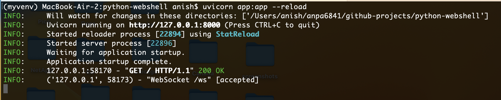
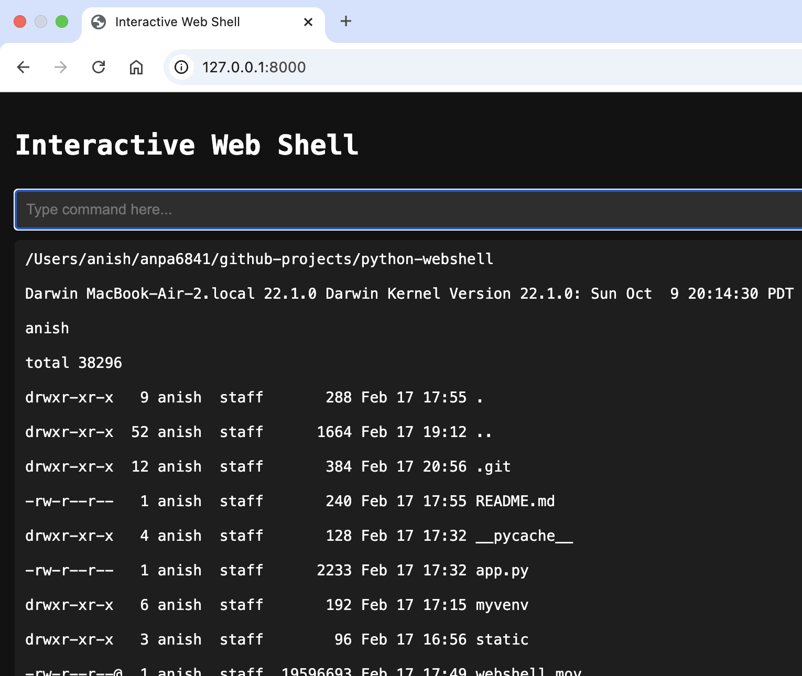

### Webshell Setup

- python -m venv myvenv
- source myvenv/bin/activate
- pip install fastapi uvicorn python-socketio
- uvicorn app:app --reload

- <a href="https://github.com/anpa6841/webshell/blob/master/webshell.mov">Webshell Demo</a>

### Screenshots

#### App Logs

#### Command Output

